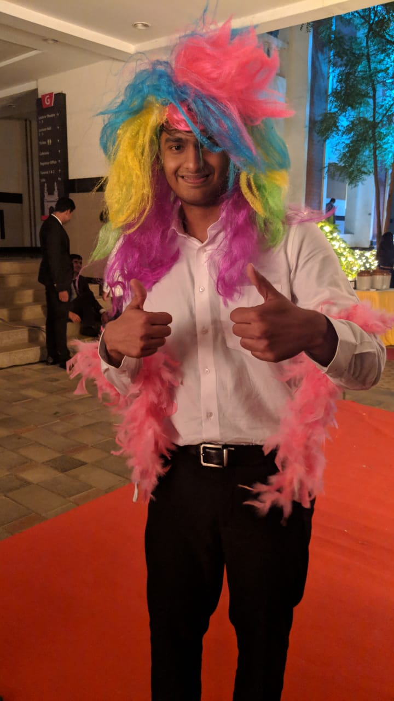

Hi! I'm a graduate student at the department of [Electrical and Computer Engineering](https://www.ee.ucla.edu) at [UCLA](https://samueli.ucla.edu). My interests are primarily in Machine Learning and Computer Vision but am also interersted in Privacy for Machine Learning. At UCLA I work with [Prof. Nader Sehatbakhsh](https://ssysarch.ee.ucla.edu/nader/) on Privacy Preserving Machine Learning. Before UCLA I was an undergraduate in Electrical Engineering at [Mahindra Ecole Centrale](https://www.mahindrauniversity.edu.in) and was adviced by [Prof. Arya Kumar Bhattacharya](https://www.mahindraecolecentrale.edu.in/faculty/arya-kumar-bhattacharya) on applying Deep Learning to problems in the steel casting industry. I also spent an amazing summer in Paris at [Elseware](https://www.elseware.fr)  where I worked with [Patrick Naim](https://www.linkedin.com/in/patricknaim/?originalSubdomain=fr) on using NLP to perform classification of risk based articles and documents. Apart from work I love playing football(soccer) and had the best time representing my undergraduate college for 4 years as a member of the football team, I also captained the side my final year of college! I am also a big fan of [Arsenal](https://www.arsenal.com) football club and enjoy reading both fiction and non-fiction!

